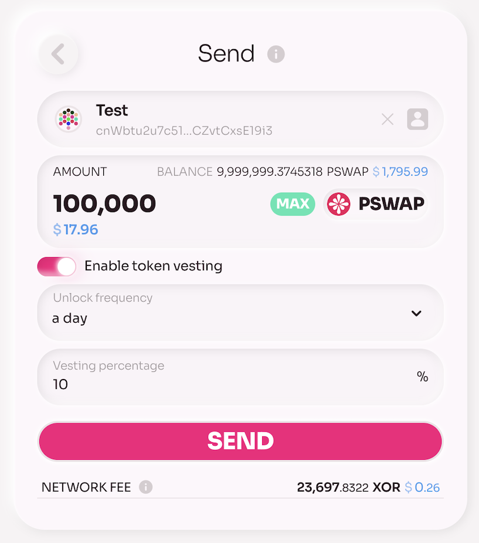
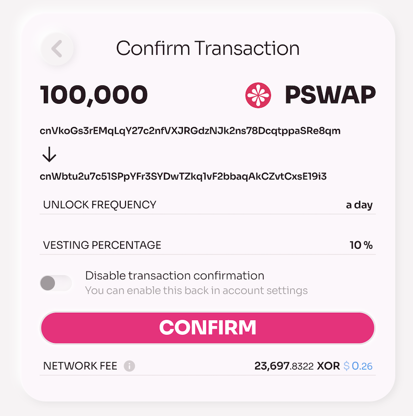

# Vesting in Cryptocurrency

Vesting is a method used in cryptocurrency projects to gradually release tokens over a specific period rather than distributing them all at once. Vesting is commonly applied to tokens allocated to project teams, early investors, and contributors, with the goal of encouraging long-term commitment and reducing the risk of sudden large sell-offs that could destabilize the token’s value.

For more details, see[Vesting tokens in SORA](/vesting-tokens.md)

## Vesting in Polkaswap

In Polkaswap, you can enable token vesting when sending tokens. Open the _Send Token_ screen and switch on the _Enable Token Vesting_ toggle. Then, fill in the details for the vesting transaction:

- **Unlock Frequency**: Set how frequently tokens will unlock in the recipient's wallet. Options include 1 day, 7 days, 30 days, 60 days, and 90 days.
- **Vesting Percentage**: Specify the percentage of tokens to unlock in each interval.

Below this section, you’ll see the _Network Fee_, which varies based on the total amount of tokens to be vested.

Once you’re ready, click _Send_. You’ll be directed to a confirmation page to review the vesting transaction details.

## The recipient

The recipient will see the locked tokens in their wallet. According to the vesting schedule you set, tokens will be unlocked in the recipient’s wallet at each specified interval.

## Learn More

- [Vesting tokens in SORA](/vesting-tokens.md)
