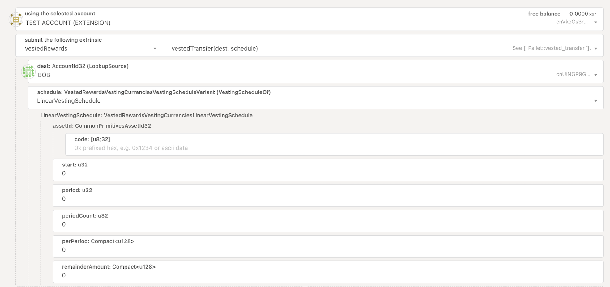
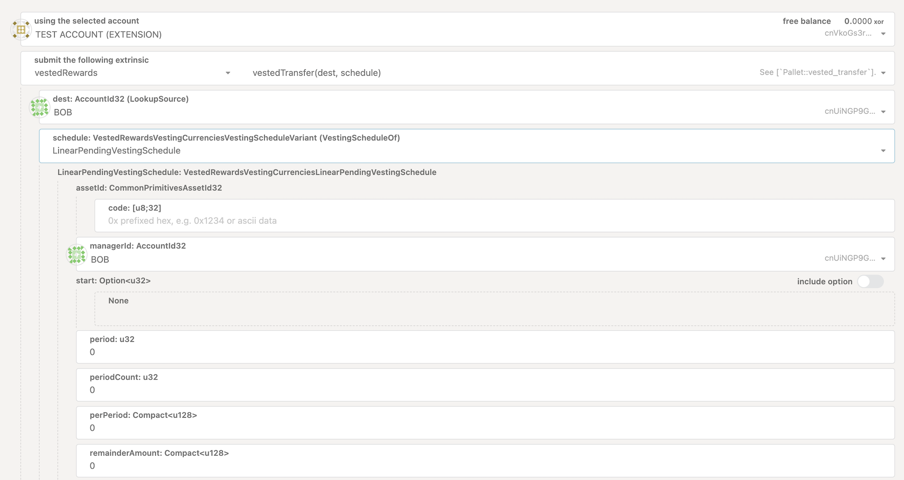

# Vesting in Cryptocurrency

Vesting is a method used in cryptocurrency projects to gradually release tokens over a specific period rather than distributing them all at once. Vesting is commonly applied to tokens allocated to project teams, early investors, and contributors, with the goal of encouraging long-term commitment and reducing the risk of sudden large sell-offs that could destabilize the token’s value.

## Key points of Vesting

Vesting serves as an essential mechanism in cryptocurrency projects for:

- Aligning Incentives: Ensuring that team members, investors, and contributors have a vested interest in the long-term success of the project.
- Increasing Security for Investors: By slowing the release of tokens, vesting reduces the risk of sudden, large sales that could devalue the token.
- Promoting Commitment: Vesting encourages founders, team members, and early supporters to remain committed to the project over the long term.

## Business Cases for Vesting

### Token Distribution for Founders and Team Members

A project may allocate a percentage of tokens to founders, developers, and other core team members with a multi-year vesting schedule to ensure their commitment. This structure helps prevent "rug pulls" (where team members sell all their tokens and abandon the project) and aligns the team’s incentives with the project’s success.

### Incentives for Early Investors

Early-stage investors who provide crucial funding often receive tokens with a vesting schedule. This not only reduces the risk of large-scale sell-offs but also gives early investors a financial incentive to support the project’s growth and contribute to long-term stability.

### Staking and Governance Rewards

In decentralized finance (DeFi) projects, users who stake their tokens or participate in governance may earn rewards that vest over time. This approach builds loyalty among users by incentivizing ongoing participation and helps prevent users from rapidly liquidating rewards, stabilizing the token's value.

### Token Allocation for Advisors and Partners

Projects may allocate tokens to advisors or strategic partners with a vesting schedule. This incentivizes ongoing guidance and collaboration, ensuring that advisors remain engaged and aligned with the project’s goals over the long term.

### Ecosystem Growth Initiatives

Some projects reserve tokens for ecosystem growth, such as grants for developers, partnerships, or community rewards. These tokens may vest over a set period as milestones are met, encouraging steady, sustainable expansion rather than short-term gains.

## How Vesting Works in SORA

In SORA, the _vestedRewards_ pallet offers an extrinsic _vestedTransfer_ allowing users to set up different types of vesting schedules:

- LinearVestingSchedule
- LinearPendingVestingSchedule

To initiate the vestedTransfer extrinsic, you’ll need to provide the following values:

- **Initial amount**: The number of tokens you want to transfer.
- **Period**: The duration over which you wish to distribute the tokens.
- **Vesting percentage**: The portion of tokens to be distributed each period.

### LinearVestingSchedule

Using the _vestedTransfer_ extrinsic with _LinearVestingSchedule_ enables the distribution of tokens evenly over a specified period and amount.

Parameters:

- **assetId**: The token address.
- **start**: The block number in the SORA blockchain.
- **period**: Unlock intervals for tokens in recipient wallets, measured in blocks.
- **periodCount**: The number of periods, calculated as a percentage of the total amount (divide 100% by the number of periods).
- **perPeriod**: The amount of tokens to distribute per period, calculated as the initial amount multiplied by the vesting percentage.
- **remainderAmount**: If any tokens remain after calculating the per-period distribution, they can be added here to be included in the final distribution.

### LinearPendingVestingSchedule

The _vestedTransfer_ extrinsic with _LinearPendingVestingSchedule_ allows for delayed token distribution over a specified period and amount, managed by an external initiator.

Parameters:

- **assetId**: The token address.
- **managerId**: The ID of the entity that will initiate vesting via the unlock_pending_schedule_by_manager() extrinsic.
- **period**: Unlock intervals for tokens in recipient wallets, measured in blocks.
- **periodCount**: The number of periods, calculated as a percentage of the total amount.
- **perPeriod**: The amount of tokens to distribute per period, calculated as the initial amount multiplied by the vesting percentage.
- **remainderAmount**: If any tokens remain after calculating the per-period distribution, they can be added here to be included in the final distribution.

## Vesting tokens in Polkaswap

You can also access vesting functionality through Polkaswap. Open the "Send Token" feature and toggle _Enable Token Vesting_. More details are available on the [Vesting tokens in Polkaswap](vesting-tokens-polkaswap.md) page.

## Learn More

- [Vesting tokens in Polkaswap](vesting-tokens-polkaswap.md)
